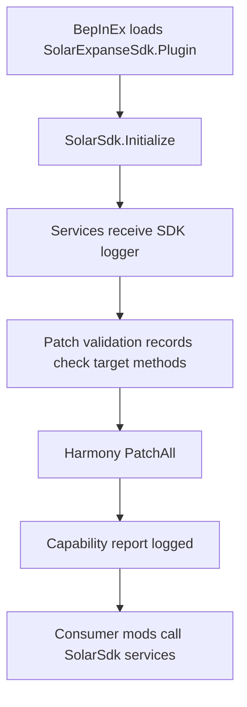
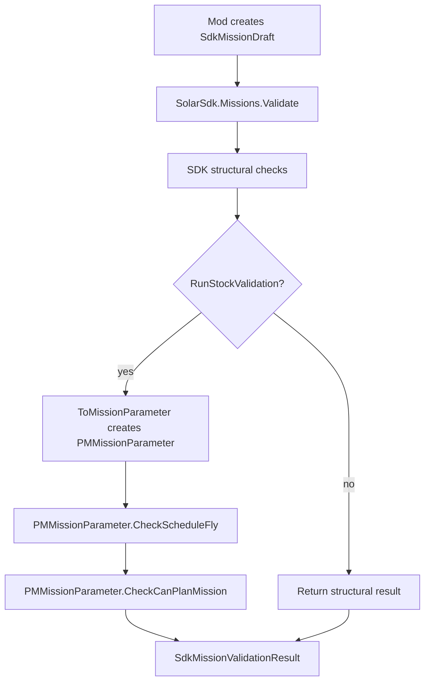
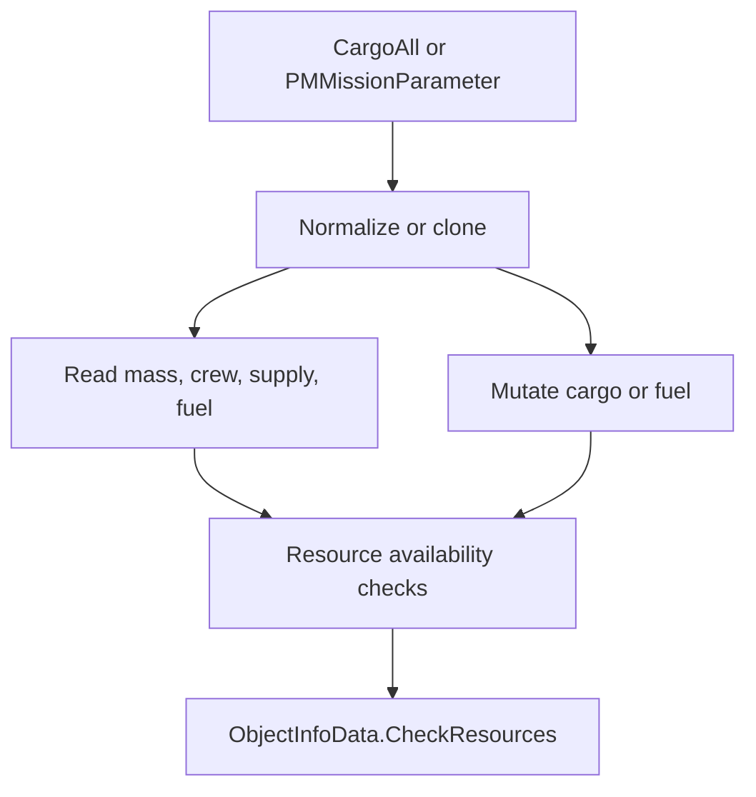
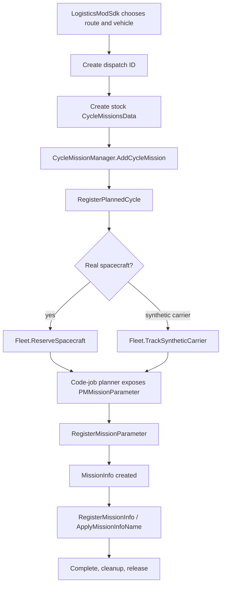
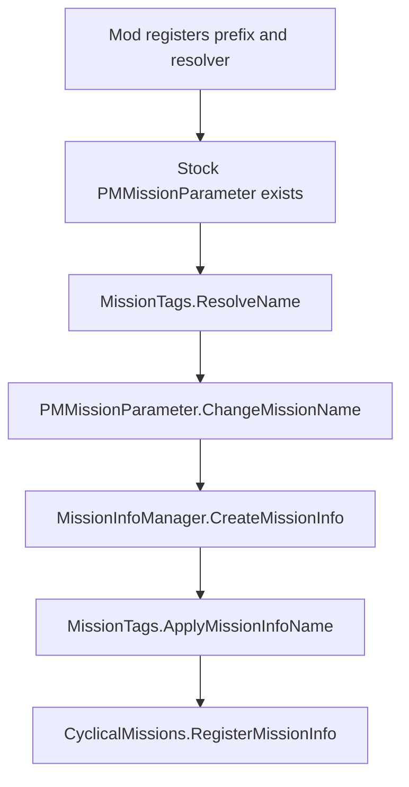
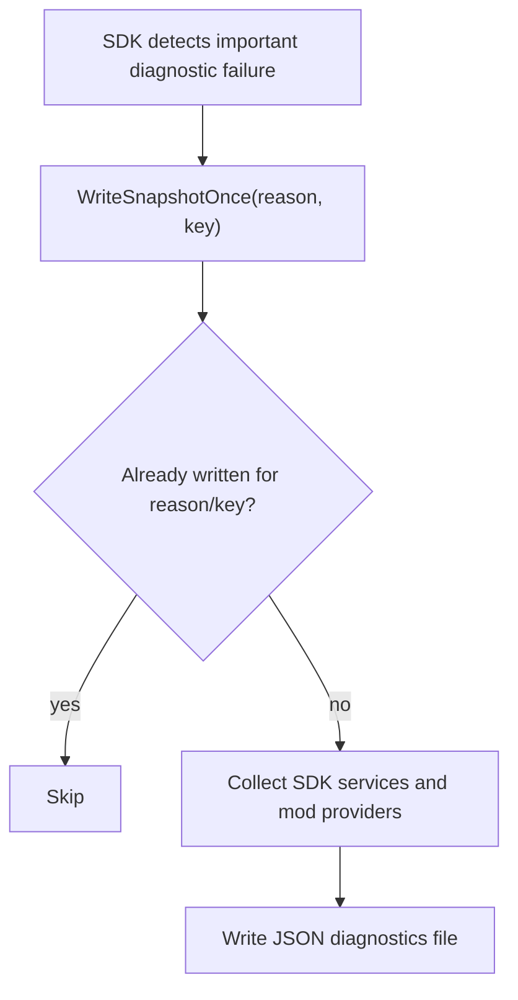

# SDK Call Flow

This document explains how SDK services sit on top of stock Solar Expanse mission code. It is written for future SDK work: when in doubt, keep stock mission creation intact and move one boundary at a time behind an SDK API.

## Startup And Patch Validation

Patch validation is diagnostic. It should tell you which stock method changed without preventing unrelated SDK surfaces from starting. `PatchAll` remains the behavioral source of truth for current hooks.

## Mission Draft To Stock Parameter

Important behavior:

- `CreateDraft` is safe and only creates an empty `CargoAll`.
- `ToMissionParameter` creates and mutates a new stock `PMMissionParameter`.
- `Validate(SdkMissionDraft)` calls `ToMissionParameter` when stock validation is enabled.
- `Validate(PMMissionParameter)` calls stock validation directly on the supplied parameter.
- `CheckScheduleFly` and `CheckCanPlanMission` are stock calls. Use them when the planner state they rely on exists.

## Loadout Helpers

Mutation boundaries:

- `CloneCargo` and `CloneCargoItem` create separate cargo objects.
- `NormalizeCargo` mutates the supplied `CargoAll`, ensures lists and special fuel cargo exist, and removes null or non-positive cargo entries.
- `AddResourceCargo`, `SetResourceCargo`, `SetLoadedFuel`, `SetPotentialFuel`, `EnsureMinimumFuel`, `CapFuelToPotential`, and `CapCargoToMass` mutate supplied stock objects.
- `CheckCargoAvailable`, `GetAvailableResource`, and `GetResourceShortfalls` inspect `ObjectInfoData`; they do not remove resources.

Stock resource removal remains in the mission launch path, especially `PMTabSchedule.CreateFly`.

## Logistics Cycle Dispatch

The dispatch ID is the spine. It should appear in:

- `sdk.cycles` cycle creation and phase logs.
- `sdk.missionPlanning` code-job and mission-info logs.
- `sdk.fleet` reservation or synthetic-carrier logs.
- diagnostics snapshots.
- LogisticsModSdk verbose route/cycle logs.

## Dispatch Resolution Order

`SolarSdk.CyclicalMissions.FindDispatchId(PMMissionParameter)` resolves in this order:

1. Explicit `PMMissionParameter` registration.
2. Carrier Unity instance identity.
3. Real spacecraft ID.
4. Active stock cycle lookup for the spacecraft.

`FindDispatchId(MissionInfo)` resolves through the created mission ID first, then through the mission spacecraft instance or real spacecraft ID.

Synthetic carriers rely on instance identity and dispatch tracking. Negative spacecraft IDs are not treated as real fleet reservations.

## Mission Name Flow

Use `RegisterMissionPrefix` for fixed tags such as `[LOGI]`. Use `RegisterNameResolver` when a mod can infer a name from route, cargo, dispatch, or mission context after stock code has rebuilt a parameter.

## Failure And Snapshot Flow

Automatic snapshots are rate-limited by reason and key. Current automatic reasons include missing dispatch correlation, planner-not-started paths, fleet reservation conflicts, synthetic carrier conflicts, SDK event handler exceptions, and cycle failure phases.

## What The SDK Does Not Own Yet

The SDK currently does not fully own:

- stock trajectory search and porkchop/fastest route mutation,
- stock mission launch through `PMTabSchedule.CreateFly`,
- stock resource removal transactions,
- stock `MissionInfo` construction,
- full cyclical mission construction.

Those are intentionally still stock-driven or LogisticsModSdk-driven. The SDK wraps and observes the boundary first, then future passes can migrate behavior in small testable slices.

